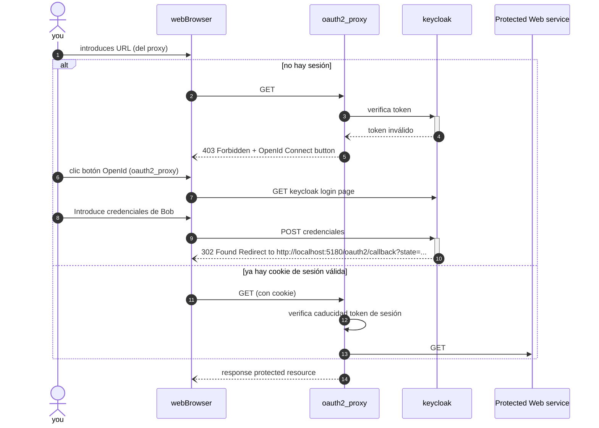
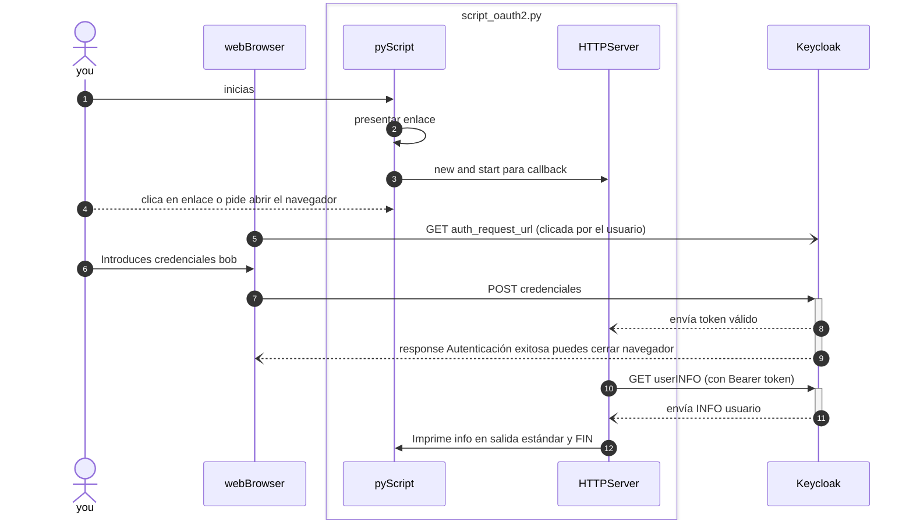

# _

![Image Repo][i1]

Pretendo jugar en este repo con la autenticación oAuth2 para realizar un entorno *demo* sobre [*keycloak*][2] y [*OAuth2 Proxy*][1] con un script que despliegue esto de forma automatizada y auto-documentada, y permita demostrar rápidamente su funcionamiento.

- [Qué es *keycloak*](#qué-es-keycloak)
- [Qué es *OAuth2 Proxy*](#qué-es-oauth2-proxy)
- [Pre-requisitos](#pre-requisitos)
- [Ejecutar la demo](#ejecutar-la-demo)
  - [Despliegue del entorno](#despliegue-del-entorno)
  - [Acceso a Keycloak](#acceso-a-keycloak)
  - [Acceso a servicio WEB protegido](#acceso-a-servicio-web-protegido)
  - [Ejecución de script que realiza una autenticación oauth2 contra keycloak](#ejecución-de-script-que-realiza-una-autenticación-oauth2-contra-keycloak)
- [Troubleshooting](#troubleshooting)
- [Disclaimer](#disclaimer)
- [Contributing](#contributing)

## Qué es *keycloak*

Keycloak es una solución de código abierto **para la gestión de identidades y accesos (IAM)**. Proporciona autenticación centralizada, Single Sign-On (SSO), y autorización, permitiendo a los usuarios autenticarse una vez y acceder a múltiples servicios sin necesidad de múltiples inicios de sesión.

Keycloak soporta **múltiples métodos de autenticación**, incluyendo autenticación multifactor, y facilita la integración con aplicaciones existentes mediante **estándares como OAuth2, OpenID Connect y SAML**. Además, ofrece administración centralizada de **políticas de seguridad y control de acceso**.

Son importantes los siguientes [términos y conceptos *core*][4] que expresa su documentación oficial:

- ***Realms*** (reinos): un realm gestiona un conjunto de usuarios, credenciales, roles y grupos. Un usuario pertenece a un *realm* e inicia sesión en él. Los *realms* están aislados entre sí y solo pueden gestionar y autenticar a los usuarios que controlan.
- ***Clients*** o clientes, son entidades que pueden solicitar a Keycloak que autentique a un usuario. La mayoría de las veces, los clientes son aplicaciones y servicios que desean utilizar Keycloak para asegurarse y proporcionar una solución de inicio de sesión único. Los clientes también pueden ser entidades que solo desean solicitar información de identidad o un token de acceso para poder invocar de manera segura otros servicios en la red que están asegurados por Keycloak

## Qué es *OAuth2 Proxy*

La implementación de un servicio que requiera una autenticación o control de acceso es un proceso repetitivo, crítico y muy susceptible a cometer errores. Por eso se puede utilizar una solución como la que ofrece [*OAuth2 Proxy*][1]

*OAuth2 Proxy* es un proxy inverso y servidor de archivos estáticos que proporciona autenticación utilizando proveedores (Google, Keycloak, GitHub y otros) para validar cuentas por correo electrónico, dominio o grupo.

En resumen, es una pasarela de autenticación que se enfrenta delante de un servicio que desees proteger.

## Pre-requisitos

- Intérprete *bash*
- '*docker*' y '*docker compose*' en tu sistema.
- Para la demo completa, y [según instrucciones](./bin/LEAME.txt), descargar el binario en la carpeta `./bin` de este repo según tu arquitectura.

## Ejecutar la demo

### Despliegue del entorno

Clónate el repo y con BASH deberás lanzar este script:

```bash
./demo.sh
```

El script tomará las siguiente acciones:

🚧 Se procederá a levantar lo siguiente...

1. Keycloak en `http://localhost:8080`
2. Un servicio WEB protegido en `http://localhost:8000`
3. oauth2_proxy en `http://localhost:4180` como servicio en docker 🐞 (not working)
4. oauth2_proxy en `http://localhost:5180` ejecutado como binario en host local

(1.2.3 con docker compose y 4 con el binario que has descargado)

### Acceso a Keycloak

Podrás acceder a keycloak con estas credenciales:

- user: `admin`
- password `admin`

Este keycloak se ha aprovisionado con una configuración de dos *clients* para *oauth2* en el *realm* master. Para ello se utilizaron [las guías oficiales][3] y [la CLI de keycloak][5]. Se describe en la siguiente [guía][ri01] cómo se configura manualmente a través de la interfaz los *clients*. Y en los ficheros [`oauth2_proxy.json`][s2] y [`pyscript.json`][s3] la configuración json de estos para su importación (que no es necesaria porque [se aprovisionan automáticamente][s4]).

También se ha creado el usuario Bob con las siguientes credenciales:

- user: `bob@example.com`
- password `123`

### Acceso a servicio WEB protegido

Deberías poder acceder al servicio web protegido por *oauth2* accediendo a [`http://localhost:5180`](http://localhost:5180) **con el usuario Bob**. A través del puerto `4180` deberíamos poder acceder también ([ver throubleshooting](#troubleshooting))

Nota importante: Con el usuario `admin` no podrás acceder al servicio Web protegido.

Puedes comprobar un acceso si autenticación ni autorización a directamente por [`http://localhost:8000`](http://localhost:8000). Este puerto se puede no mapear para que quede aislado dentro de la red docker.



**Consideraciones:**

- **Tokens y Sesiones**: Cuando te autenticas con Keycloak, obtienes un token de acceso (Access Token) y, posiblemente, un token de actualización (Refresh Token). Estos tokens tienen un tiempo de vida (TTL, Time To Live) y permiten al usuario acceder a los recursos protegidos sin necesidad de autenticarse repetidamente mientras el token sea válido.
La sesión del usuario en Keycloak puede estar eliminada, pero si el token de acceso todavía es válido y no ha expirado, el oauth2_proxy seguirá permitiendo el acceso al servicio web.

- **Validación de Tokens en oauth2_proxy**: El oauth2_proxy no necesariamente valida cada solicitud contra Keycloak para verificar si la sesión del usuario sigue siendo válida. Generalmente, el proxy valida el token de acceso localmente para reducir la latencia y la carga en el servidor de autenticación.
Esto significa que, aunque elimines la sesión en Keycloak, el token de acceso ya emitido todavía puede ser aceptado por el oauth2_proxy hasta que expire.

### Ejecución de script que realiza una autenticación oauth2 contra keycloak

A fin de demo, también se crea [un script python][s1] que autentica contra keycloak, y obtenido un token válido, también realiza una consulta de los datos de este usuario contra keycloak (no emplea ningún proxy).

En este diagrama de secuencia, se ilustra lo que hace el script:



## Troubleshooting

Queda como desarrollo pendiente el acceso por el servicio `oauth2_proxy` desplegado por `docker compose` y que responde en el puerto `4180`.

## Disclaimer

Esto este escenario es una [*trapallada*](https://academia.gal/dicionario/-/termo/trapallada) para jugar un poco con los conceptos. No lo imites sin comprenderlo. No lo uses para proteger nada.

☠️ ☠️ ☠️ ☠️ ☠️ ☠️ ☠️ ☠️ ☠️ ☠️ ☠️ ☠️ ☠️ ☠️ ☠️  
☠️ Esto es una prueba conceptual!
☠️ No lo despliegues tal cual
☠️ en un entorno en producción!
☠️ ☠️ ☠️ ☠️ ☠️ ☠️ ☠️ ☠️ ☠️ ☠️ ☠️ ☠️ ☠️ ☠️ ☠️  

Habrá constraseñas y tokeen *hardcodeados* puestos deliberadamente, entre otras posibles *lindezas*.

## Contributing

Cualquier contribución que hagas es muy apreciada.

Si tienes una sugerencia que podría mejorar esto, por favor haz un fork del repositorio y crea un pull request. También puedes simplemente abrir un problema (issue) con la etiqueta "enhancement". ¡No olvides darle una estrella al proyecto! ¡Gracias de nuevo!

1. Haz un Fork del Proyecto
1. Crea tu Rama de Característica (`git checkout -b feature/AmazingFeature`)
1. Confirma tus Cambios (`git commit -m 'Add some AmazingFeature'`)
1. Haz Push a la Rama (`git push origin feature/AmazingFeature`)
1. Abre un Pull Request

Gracias! 🙏

<!-- Scripts -->
[s1]: ./script_oauth2_demo.py 'Script python demo oauth2'
[s2]: ./keycloak_configs/oauth2_proxy.json
[s3]: ./keycloak_configs/pyscript.json
[s4]: ./keycloak_configs/config_provision.sh

<!-- Referencias internas -->
[ri01]: ./doc/keycloak.md 'Step by step config client'

<!-- Referencias externas -->
[1]: https://github.com/oauth2-proxy/oauth2-proxy/ 'Github oauth2-proxy'
[2]: https://www.keycloak.org/ 'Official Site: Keycloak'
[3]: https://www.keycloak.org/guides#getting-started 'Getting started'
[4]: https://www.keycloak.org/docs/latest/server_admin/index.html#core-concepts-and-terms 'Keycloak Doc: Conceptos Core y términos'
[5]: https://www.keycloak.org/docs/latest/server_admin/index.html#admin-cli 'CLI Keycloak'

<!-- Imágenes -->
[i1]: ./doc/img/auth-wars.png 'Auth Wars: The Proxy Awakens. Keycloak & OAuth2 Proxy Demo'
